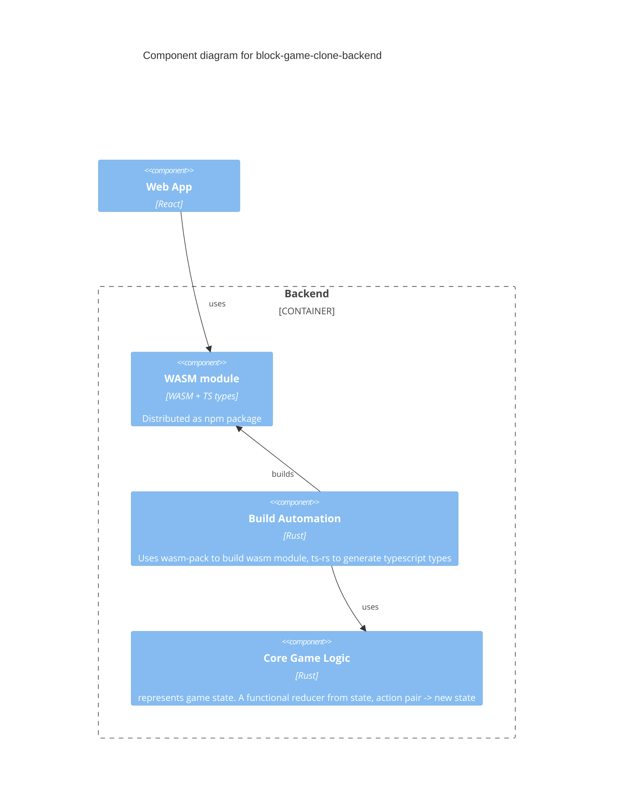

## block-game-clone-backend

This project contains the core game logic for https://github.com/ethanSE/block_game_clone implemented in Rust.

+ Implements game logic as a function of GameState + Action -> GameState

+ Implements greedy AI opponent

+ Build automation for compiling to WebAssembly

+ Build automation for generating TypeScript types from Rust types for TS <-> Rust (as Wasm) interop in browser as strings

### Building Package (from project root)
with Rust, Cargo, wasm-pack installed:

```shell
cargo run -p build_wasm_ts_module  //from project root
```

### Publish wasm module to NPM

+ bump version number in block-game-clone-backend/Cargo.toml

+ build

+ wasm-pack publish

## License

* MIT license (http://opensource.org/licenses/MIT)


# Architecture




The goal here was to create a single single repository that contains the game logic. The idea is that this logic could be used anywhere including:
- in the current web app as compiled to web assembly
- on a server for a multiplayer mode
- in any other project (training a better AI opponent?)
